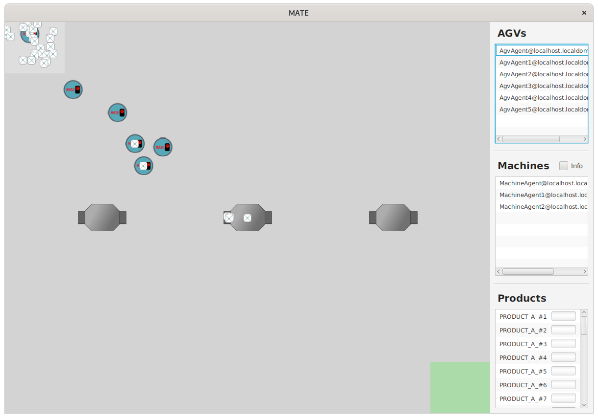
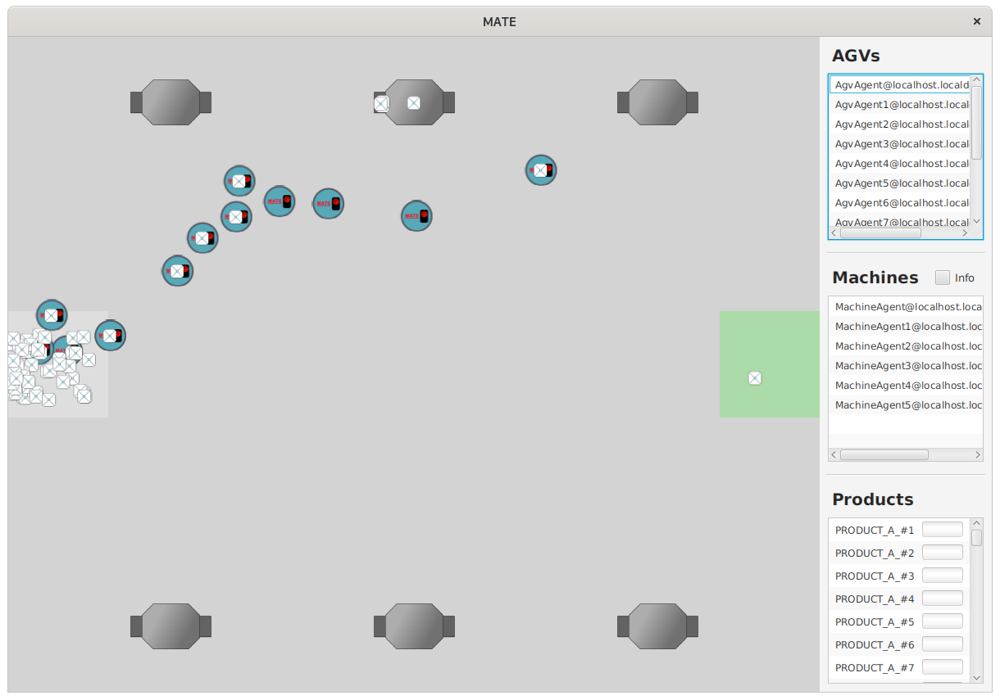
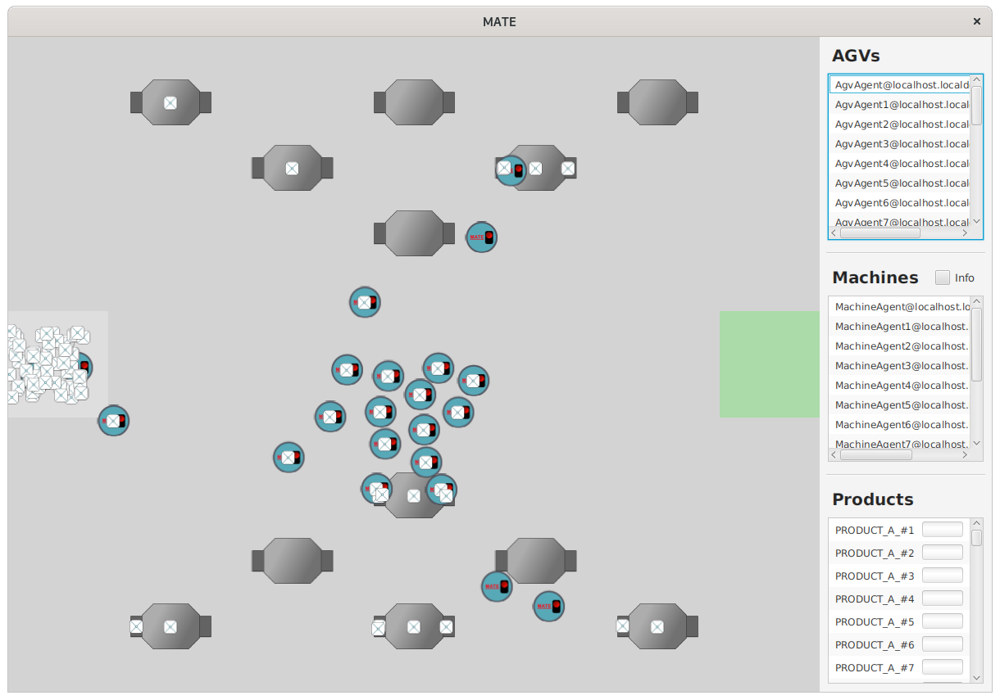

This repository contains the source code for the paper "MATE: A Testbed for Simulating Multi-Agent Manufacturing Systems" submitted to SEAMS 2021.

MATE is a testbed for evaluating task allocation algorithms in a Jadex-based multi-agent manufacturing simulation. In the simulation, the self-organized AGVs are steered by the machines' behavior—machines control the AGVs' routing behavior by switching capabilities.

# Requirements
+ Java 11
+ Python 3.8

<strong>Note</strong>: To ease usage, we provide a VirtualBox image via figshare: https://figshare.com/articles/software/MATE_ova/13905353


# Setup

The MATE project consists of two parts: Java simulation and Gym environment.

+ To create the necessary gRPC code:

```$xslt
cd jobshop_simulation
./gradlew installDist
```

+ To install the necessary Python packages:

```$xslt
cd jobshop_gym
pip install -r requirements.txt
```

# Running
First, the user needs to run the Java simulation to start the gRPC server—to do so, switch into the jobshop_simulation directory and run:

```$xslt
cd jobshop_simulation
./gradlew run
```
The default port is 50051; the user can change the port by running:

```$xslt
./gradlew run --args=50052
```

Once the server has started, the user can run the Gym environment; switch into the jobshop_gym directory, and type:

```$xslt
cd jobshop_gym
python3 main.py
```

If the port has been changed in the simulation, the port in the Python file needs to be changed as well! 

Alternatively, the user can import and run the two projects via IntelliJ and PyCharm.

<strong>Note</strong>: The simulation needs to be restarted once the Gym environment gets restarted!

# Environment Configuration

The user can add new MATE environments by specifying a unique TOML file and placing them in the following directory:

```$xslt
/jobshop_simulation/src/main/resources/settings/
```

Furthermore, the user can find a set of predefined environments in the above directory. Refer to "triple.toml "to get an overview of the various configuration options.

## Three machines – triple.toml

A simple environment that contains three machines and two product types. Machine failures occur at the start of an episode, and there is only a single randomized product batch. Products have single-step workflows. Machines can allocate roles only once at the beginning of an episode.



## Six machines – default.toml

The environment is a more challenging version of the previous environment. Here, six machines must process three different product types as fast as possible. As previously, allocating roles is allowed only once, at the start of an episode.



## Twelve Machines – difficult.toml

The environment showcases the more advanced features of MATE. Twelve machines must process products with varying workflow lengths. Thereby, each machine can switch between four different capabilities. Four product batches are spawned in fixed intervals, and machines can allocate roles on the arrival of new batches.




# Gym

MATE is a multi-agent Gym environment. Hence, state, action, and reward values are packed in lists, one entry for each agent.

+ State: MATE offers a vast state-space that can be filtered to build an appropriate state-space for the task at hand. The various attributes are stored in a dictionary so that the user can choose the proper attributes.

+ Action: An agent's action is a tuple consisting of two parts:
    + Capability change: The capability the machine will change to; a capability change requires a set-up time.
    + Maintenance tag: If set to true, the machine will maintain/repair the previously selected capability. The maintenance and repair times can differ. The maintenance operation will reset the failure rate of a capability to zero; if the capability is already broken, the repair operation will be used instead.

+ Reward: MATE offers a variety of different reward signals that are accessible via a dictionary object. Some reward signals are machine-specific (e.g., machine utilization); others concern all machines (e.g., makespan). Note: Makespan, flowtime, tardiness, and lateness will return the correct values only after all products have been spawned or completed. Otherwise, they will return the worst possible value as a placeholder—the episode's timeout value. The specific reward implementations can be viewed in ``jobshop_simulation/src/main/java/jobshop/environment/impl/Environment.java`` (calcMakespan(), calcLateness(), ...).


The user can utilize Gym wrappers to ease the construction of individualized state, reward, and action spaces. Wrappers can reduce the vast state space so that the user can focus only on essential attributes. The Python project contains one example for each wrapper-type (ActionWrapper, RewardWrapper, ObservationWrapper).
